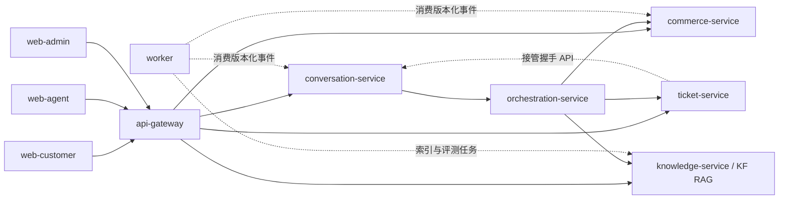

# 模块边界

## 依赖方向

## 强制规则

箭头表示允许的端口依赖，不表示分布式原子事务。页面写申请经 Gateway → Commerce 共用领域预检/确认；聊天由 Orchestration 调用同一领域端口。混合查询由 Orchestration 顺序调用 Commerce、Knowledge、Commerce；Knowledge 通过请求级历史适配读取 Conversation 的授权正式快照。详见四份实施标准 C-11、B-11、E-11。

1. 三个前端只访问 API Gateway，不知道内部数据库和服务地址。
2. API Gateway 负责协议与安全入口，不承载领域规则。
3. Conversation Service 保存会话事实，但不自行决定业务路由。
4. Orchestration Service 决定意图、风险、状态机和路由，不直接拥有订单或知识数据。
5. Commerce Service 是商品、订单、物流、售后和发票事实的唯一服务边界。
6. Knowledge Service 保留 KF RAG 核心链路，只提供知识检索与生成，不修改交易事实。
7. Ticket Service 是人工工单和客服协作事实的唯一服务边界。
8. Worker 通过版本化事件执行异步任务，不成为业务事实来源。
9. `packages/domain` 不依赖框架和基础设施；`packages/*` 不反向依赖 `apps/*`。
10. 跨服务写入使用服务接口或 Transactional Outbox 事件，不直接修改他人数据表。

## V1 部署原则

逻辑边界不等于必须一模块一进程。V1 可将低负载业务模块合并部署，以降低局域网运维成本；Knowledge Service 和 Worker 因依赖、资源与任务模型不同，优先保持独立运行。
