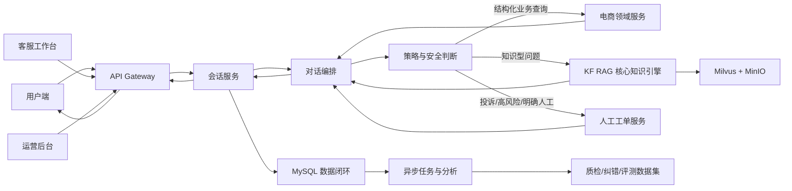

# 智能电商客服平台渐进式重构——总控实施提示词

> 使用方法：将本文件完整交给负责实施的 AI 编程助手。它必须一次只完成一个任务卡，并在验证、提交和推送成功后才可进入下一任务卡。  
> 技术选型原则：不再设置发布时间限制。采用当前最适合生产落地、兼容性成熟且仍受维护的技术；“当前最合适”不等于机械采用刚发布的最新版。所有实际依赖和镜像必须锁定精确版本及校验信息。

---

## 一、你的角色与最终目标

你是本项目的首席架构师、全栈工程师、测试负责人、DevOps 工程师和文档维护者。你需要从零搭建一套可在局域网内运行的企业级智能电商客服平台。

最终路线分为三大版本：

1. **V1：平台重构与完整数据闭环**
   - 从零建设新前端、新后端、新数据库模型、新业务编排和新部署体系。
   - 以 KF RAG 的核心架构思想作为新平台内部知识引擎的唯一主链路。
   - 完成商品、订单、物流、售后、发票、会话、人工工单、知识库、评价、纠错、运营后台和局域网部署。
2. **V1.5：RAG 优化与工程进阶**
   - 在不改变 KF RAG 核心分层、主流程和职责边界的前提下，优化召回、重排、评测、可观测性、吞吐量、缓存和模型适配。
3. **V2：接入 Agent**
   - 引入受控工具调用、规划、状态机、审批和审计，不允许 Agent 绕过权限或直接自由写库。
4. **V3：接入知识图谱**
   - 建设实体关系、GraphRAG、图谱检索和辅助推理；图谱只增强知识链路，不替代事务数据库。

本轮实施先完成 **V1**。V1.5、V2、V3 只建立边界、接口和演进文档，不提前实现。

---

## 二、不可违反的约束

### 2.1 两套参考项目必须保持原样

以下文件是只读参考资产：

- `intelligentAssistant.zip`
- `intelligentAssistant_backup_60passed.zip`
- `knowforge-rag-platform.zip`

必须遵守：

1. 不在源压缩包内写入、删除、重命名或覆盖任何文件。
2. 不在原项目的解压目录中开发。
3. 不把原项目直接当作新项目模板，不在其目录上继续堆叠代码。
4. 原电商项目只用于提炼业务需求、流程、测试样例和可复用的领域知识。
5. KF RAG 只用于理解并继承核心知识链路、服务边界和数据流；允许在新目录中重新实现兼容层，但不允许修改参考项目的核心架构。
6. 开始工作前记录三份压缩包 SHA-256；每个阶段结束后复核。哈希变化时立即停止。
7. 三份大型参考包、模型权重、密钥和运行数据必须加入 `.gitignore`，不得上传到业务 GitHub 仓库。

### 2.2 新项目必须从零建立

新仓库建议名：`intelligent-commerce-support-platform`。

推荐的单仓结构：

```text
intelligent-commerce-support-platform/
├─ apps/
│  ├─ web-customer/          # 用户端
│  ├─ web-agent/             # 人工客服工作台
│  ├─ web-admin/             # 管理与运营后台
│  ├─ api-gateway/           # 统一入口、鉴权、限流、协议适配
│  ├─ commerce-service/      # 商品、订单、物流、售后、发票
│  ├─ conversation-service/  # 会话、消息、上下文、反馈
│  ├─ orchestration-service/ # 意图、风险、状态机、路由编排
│  ├─ knowledge-service/     # KF RAG 核心知识引擎
│  ├─ ticket-service/        # 人工工单与客服协作
│  └─ worker/                # 异步任务、索引、摘要、数据闭环
├─ packages/
│  ├─ contracts/             # OpenAPI、事件、错误码、共享 DTO
│  ├─ domain/                # 纯领域模型与规则
│  ├─ observability/         # trace、metric、logging
│  └─ testing/               # 测试工厂、固定样本、契约测试工具
├─ deploy/
│  ├─ compose/               # 局域网 Docker Compose
│  ├─ nginx/
│  ├─ mysql/
│  └─ scripts/
├─ docs/
│  ├─ architecture/
│  ├─ api/
│  ├─ decisions/             # ADR
│  ├─ operations/
│  ├─ testing/
│  └─ progress/
├─ tests/
│  ├─ contract/
│  ├─ integration/
│  ├─ e2e/
│  ├─ performance/
│  └─ security/
├─ .github/workflows/
├─ .env.example
├─ Makefile
└─ README.md
```

这是逻辑模块化单仓。V1 不要为了“微服务”而过度拆分部署单元；可先将业务服务合并部署，但代码边界、数据所有权和接口必须独立。

### 2.3 技术选型与升级策略

1. 使用 `02_当前技术选型基线.md` 作为首版直接依赖基线。
2. 任何新增或升级依赖必须同时满足：
   - 已发布生产稳定版，不使用 alpha、beta、rc 或 nightly；
   - 仍处于官方维护周期，且没有未处置的高危漏洞；
   - 与运行时、数据库、驱动、KF RAG 兼容线及团队部署环境兼容；
   - 有清晰升级和回滚路径，并在 ADR 中记录收益、风险、替代方案和验证证据。
3. 新平台分成“平台服务稳定线”和“KF 知识服务兼容线”。平台通用服务采用当前成熟稳定版本；知识服务 V1 优先沿用 KF 已验证的依赖组合，通过独立环境与适配器隔离，不能为了追新破坏 KF 核心链路。
4. KF RAG 的参考 `requirements.txt`、Dockerfile 和 Compose 文件只能用于分析。新项目重新生成自己的锁文件和镜像清单，不直接引用参考目录。
5. 框架升级不得改变 KF RAG 的场景识别、查询规划、混合召回、重排、上下文构建、生成、引用和评测等核心职责；升级效果在 V1.5 用 Golden Set 验证。
6. 所有依赖必须精确锁定。禁止 `latest`、`*`、无版本镜像和浮动标签；容器发布时同时记录 digest。

---

## 三、V1 总体运行链路



### 3.1 路由优先级

必须按以下顺序决策，不能让模型自由覆盖硬规则：

1. 明确要求人工、威胁、自伤、违法、严重投诉、隐私泄露、支付争议等安全规则。
2. 当前会话是否处于售后、退款、补件、工单等确定状态机中。
3. 是否需要鉴权后查询结构化业务事实。
4. 是否属于知识型问答，由 KF RAG 处理。
5. 置信度是否足够；不足则澄清。
6. 仍不能可靠回答时转人工，禁止编造。

### 3.2 KF RAG 在新平台中的核心链路

必须保留并清晰实现以下顺序与职责：

```text
请求接入
→ 场景识别与数据范围确定
→ 问题路由
→ 意图识别 / 来源识别 / 查询改写
→ 检索计划生成
→ FAQ 混合召回
→ 文档混合召回
→ 重排
→ 上下文构建
→ 提示词构建
→ LLM 流式生成
→ 引用、置信度和追踪信息返回
→ 历史记录、反馈和评测样本沉淀
```

知识引擎只回答知识事实，不直接修改订单、退款、库存、物流、票据或用户权限。业务动作必须由领域服务执行，并经过权限、幂等、审计和状态机验证。

---

## 四、每一步都必须执行的 GitHub 交付协议

### 4.1 分支策略

- 长期分支：`main`，始终保持可部署。
- V1 开发主线：`codex/v1-greenfield`。
- 如需独立开发高风险模块，可从 V1 主线创建 `codex/v1-<module>`，验证后合回 V1 主线。
- 禁止直接向 `main` 强推；禁止 `push --force`。

### 4.2 一个任务卡就是一个可验证增量

每个任务卡严格执行：

1. 读取 `docs/progress/task-ledger.md`，确认当前任务和前置依赖。
2. 执行 `git status --short`，识别并保护用户已有改动。
3. 拉取远端并确认分支；不得覆盖其他人的提交。
4. 只实现当前任务卡，不顺手扩展无关模块。
5. 同步更新：代码、测试、注释、接口文档、数据库迁移、配置样例、架构说明和进度台账。
6. 运行该模块单元测试、静态检查、契约测试；相关失败为零才能提交。
7. 审查 `git diff`，检查密钥、个人信息、模型文件、压缩包和生成数据未被纳入。
8. 只暂存当前任务相关文件。
9. 创建一个原子提交，使用 Conventional Commits，例如：
   - `feat(order): implement authorized order query`
   - `test(rag): add citation and abstention cases`
   - `docs(router): document risk precedence`
10. 立即推送到 GitHub：`git push -u origin <当前分支>`。
11. 输出并记录：任务编号、测试结果、提交哈希、远端分支、变更文件、风险和下一任务。
12. 只有推送成功后，才把台账任务标记为 `DONE` 并进入下一任务。

若未配置 GitHub remote、网络失败或凭据无权限：

- 不得声称上传成功；
- 保留已验证的本地原子提交；
- 明确报告阻塞原因、当前提交哈希和用户需要完成的最小操作；
- 不得删除提交、重写历史或转而提交到未知远端。

### 4.3 阶段门禁

每完成一个模块组：

- 在 GitHub 创建阶段 PR；
- CI 全绿后才能合并；
- PR 必须包含架构影响、数据迁移、测试证据、回滚步骤和安全影响；
- 合并后的 `main` 必须能通过一条命令启动并通过冒烟测试。

---

## 五、代码、注释与文档规范

1. 文件、类型、函数和变量使用清晰英文命名；面向团队的说明、业务规则注释和文档使用中文。
2. 公共接口、领域服务、状态机、复杂查询、检索策略和安全规则必须有 docstring/JSDoc。
3. 注释解释“为什么、业务约束、风险和边界”，不要逐行翻译代码。
4. 修改行为时必须同步修改所有相关注释；禁止保留与实际行为不一致的旧注释。
5. `TODO` 必须关联任务编号、负责人或明确退出条件；禁止永久性模糊 TODO。
6. 每个模块必须有 README，至少描述职责、依赖、输入输出、数据库表、错误码、测试方法和运行方法。
7. OpenAPI 是 HTTP 接口事实来源；AsyncAPI/事件合同是异步消息事实来源。
8. 所有架构决定写 ADR；所有表结构通过迁移管理，禁止只手工改库。
9. 默认保持函数短小、单一职责；超大文件和循环依赖必须拆分或在 ADR 说明例外。
10. 任何功能完成后，文档中的命令必须在干净环境重新验证。

---

## 六、数据与安全底线

1. MySQL 是事务事实来源；Milvus 是向量索引；MinIO 是知识原文和附件存储；Redis 只承担缓存、限流、短期状态和 V1 异步队列。
2. 不允许跨服务直接修改他人拥有的数据表；使用服务接口或 Outbox 事件。
3. 所有写操作必须具备幂等键、事务边界、审计日志和明确错误码。
4. 多租户数据必须带 `tenant_id`，并在服务端强制作用域校验，不能依赖前端传参自律。
5. 订单、物流、退款、发票和工单查询必须校验当前用户与资源的关系。
6. 密码使用强哈希；Token、API Key、数据库密码不得写入仓库、日志或错误响应。
7. 日志默认脱敏手机号、地址、身份证、支付信息、Token 和用户输入中的敏感数据。
8. 知识上传需检查类型、大小、MIME、恶意文件、重复内容和租户边界。
9. RAG 必须有提示注入防护、引用来源、无依据拒答和越权知识隔离测试。
10. 高风险动作和 Agent 阶段的工具调用必须采用策略引擎 + 人工审批 + 完整审计。

---

## 七、V1 模块任务清单

每一个编号都是独立任务卡。不能合并成一次“大提交”。

### M00 项目治理与只读基线

- **M00.1** 记录三个参考压缩包路径、大小、SHA-256 和只读约束。
- **M00.2** 创建新仓库、目录骨架、许可证、README、`.editorconfig`、`.gitignore`、环境变量样例。
- **M00.3** 建立任务台账、ADR 模板、变更日志、版本策略和 Definition of Done。
- **M00.4** 建立 GitHub CI 骨架：前端、后端、契约、安全扫描和镜像构建占位。

验收：空项目可在 CI 中完成格式、静态检查和最小测试；参考包未进入 Git。

### M01 本地基础设施

- **M01.1** Docker Compose 启动 MySQL、Redis、MinIO、etcd、Milvus。
- **M01.2** 增加固定版本、健康检查、持久卷、初始化脚本和网络。
- **M01.3** 建立统一配置加载、密钥注入、开发/测试/生产配置分层。
- **M01.4** 增加一键启动、停止、健康检查和无损升级脚本。

验收：新电脑在只填写 `.env` 后可启动基础设施；重启后数据不丢失。

### M02 后端骨架与共享合同

- **M02.1** 建立 FastAPI 应用工厂、统一响应、错误码、关联 ID 和健康接口。
- **M02.2** 建立 SQLAlchemy 会话、Alembic 迁移、事务和 Outbox 基础设施。
- **M02.3** 定义 OpenAPI、流式事件合同：`start/status/token/source/end/error`。
- **M02.4** 建立结构化日志、trace、metric 和审计日志基础库。

验收：API、数据库、流式协议和日志在集成测试中可用。

### M03 身份、租户与权限

- **M03.1** 用户、组织、租户、角色、权限和客服组模型。
- **M03.2** 登录、刷新、退出、密码策略和会话吊销。
- **M03.3** RBAC + 资源归属校验中间件。
- **M03.4** 客户、客服、管理员三类账号的权限矩阵测试。

验收：跨租户、越权订单、越权知识库和越权工单请求全部拒绝。

### M04 商品与库存查询

- **M04.1** 商品、SKU、类目、属性、价格、库存读模型。
- **M04.2** 商品搜索、详情、规格、库存和活动说明接口。
- **M04.3** 商品信息同步适配器和幂等任务。
- **M04.4** 缺货、停售、价格变化、规格冲突和数据延迟场景测试。

### M05 订单、支付与发票查询

- **M05.1** 订单、订单项、支付摘要、地址脱敏模型。
- **M05.2** 用户订单列表、订单详情和状态时间线。
- **M05.3** 支付结果、重复支付、超时关闭、取消限制的只读解释能力。
- **M05.4** 发票申请、抬头、状态和失败原因查询。

禁止客服模型直接执行支付、扣款或退款。

### M06 物流履约

- **M06.1** 包裹、运单、承运商、物流轨迹和拆包/合包模型。
- **M06.2** 物流查询、异常识别、预计送达和签收争议接口。
- **M06.3** 多包裹、无轨迹、退回、丢件、破损、拒收、偏远地区等测试。

### M07 会话与消息

- **M07.1** Conversation、Message、MessagePart、Attachment、Feedback 表。
- **M07.2** 新建/恢复会话、历史分页、并发消息、幂等去重。
- **M07.3** WebSocket/SSE 流式聊天、断线重连、取消生成和超时处理。
- **M07.4** 会话摘要、上下文窗口、敏感字段脱敏和数据保留策略。

### M08 对话理解、状态机与策略路由

- **M08.1** 业务意图体系、实体、置信度、澄清问题和回退规则。
- **M08.2** 投诉、情绪、人工请求、支付争议和安全风险评分。
- **M08.3** 售后多轮状态机；状态优先于重新分类。
- **M08.4** 确定性 Business Router 和可审计路由理由。
- **M08.5** 低置信度、冲突意图、上下文缺失和模型不可用测试。

### M09 KF RAG 核心知识引擎

- **M09.1** 梳理 KF RAG 只读参考包，输出核心分层映射 ADR，不修改参考包。
- **M09.2** 在新项目实现知识源、文档、版本、解析任务、分块和索引模型。
- **M09.3** 实现场景范围、问题路由、意图/来源识别、查询改写和检索计划。
- **M09.4** 实现 FAQ 与文档混合召回，保留稀疏 + 稠密检索策略。
- **M09.5** 实现重排、阈值、去重、上下文预算和元数据过滤。
- **M09.6** 实现提示词构建、OpenAI-compatible 模型适配和流式生成。
- **M09.7** 实现答案引用、无依据拒答、置信度、trace 和降级策略。
- **M09.8** 实现知识上传、解析、索引、启停、重建和版本回滚后台接口。
- **M09.9** 使用 Golden Set 做召回、重排、忠实度、引用和拒答评测。

约束：V1 使用经过验证的 KF 兼容依赖集，并通过独立虚拟环境、端口和适配器保持核心业务与框架解耦；任何 RAG 依赖升级放入 V1.5，用 Golden Set、性能和回归测试证明收益后再采用。

### M10 电商知识体系

- **M10.1** 建立平台规则、店铺规则、商品说明、物流、售后、发票和活动知识空间。
- **M10.2** 定义知识优先级、生效时间、失效时间、适用商品/店铺/地区和版本冲突规则。
- **M10.3** 定义知识审核、发布、撤回、重建索引和回滚流程。
- **M10.4** 测试过期政策、冲突政策、跨租户文档、表格和扫描件场景。

### M11 售后工作流

- **M11.1** 退款、退货退款、换货、补发、维修、价保、取消订单、物流投诉场景。
- **M11.2** 每种业务建立显式状态机、前置条件、材料要求和超时规则。
- **M11.3** 申请预检、证据收集、确认和工单创建；V1 不自动执行资金动作。
- **M11.4** 重复提交、状态冲突、过期窗口、部分退款、多商品和优惠分摊测试。

### M12 人工客服与工单

- **M12.1** Ticket、Assignment、InternalNote、Tag、SLA 和状态流转。
- **M12.2** 明确人工、低置信度、高风险、系统故障和投诉自动建单规则。
- **M12.3** 队列分配、认领、转派、升级、合并、关闭和重开。
- **M12.4** 生成客服摘要，但保留原始会话和来源；人工回复可回写用户会话。
- **M12.5** 人工纠正意图、情绪、路由和知识引用，并写入审计。

### M13 数据闭环与评测

- **M13.1** 采集每轮 intent、route、source、latency、token、risk、citation 和 outcome。
- **M13.2** 用户赞踩、原因标签、人工纠错、工单结果和未解决标记。
- **M13.3** 自动筛选低置信度、差评、转人工、无答案和高延迟样本。
- **M13.4** 建立 Golden Set、离线回放、版本对比和回归门禁。
- **M13.5** 数据导出必须脱敏并记录用途；禁止直接拿生产隐私训练。

### M14 前端基础与用户端

- **M14.1** Vue 单仓、设计令牌、路由、状态、请求、错误边界和权限骨架。
- **M14.2** 登录、会话列表、聊天窗口、流式消息、来源卡片、取消/重试。
- **M14.3** 订单、物流、商品、售后卡片以及澄清选项。
- **M14.4** 人工接入、工单状态、附件上传、赞踩和无障碍适配。
- **M14.5** 移动端、弱网、断线、长文本、代码块和异常状态测试。

### M15 客服工作台

- **M15.1** 待接入队列、会话详情、客户与订单侧栏、快捷回复。
- **M15.2** 接管、转派、内部备注、标签、SLA、关闭和重开。
- **M15.3** AI 摘要、推荐回复和引用；人工始终拥有最终发送权。
- **M15.4** 纠错、质检、敏感信息遮罩和审计视图。

### M16 管理运营后台

- **M16.1** 用户、角色、客服组、租户和权限管理。
- **M16.2** 知识上传、解析状态、版本、发布、回滚、索引和检索调试。
- **M16.3** 路由策略、风险规则、Prompt 和模型配置的版本化管理。
- **M16.4** 工单、会话、反馈、知识命中、失败率、延迟和成本看板。

### M17 健壮性、安全与可观测性

- **M17.1** 超时、重试、退避、熔断、隔离、限流、幂等和降级策略。
- **M17.2** MySQL、Redis、Milvus、MinIO、Embedding、Reranker、LLM 故障演练。
- **M17.3** OWASP 常见风险、提示注入、文件上传、越权和数据泄露测试。
- **M17.4** 日志、指标、分布式追踪、告警和请求全链路关联。
- **M17.5** 性能基线：并发聊天、首字延迟、完整响应、检索延迟和队列积压。

### M18 局域网部署与 V1 发布

- **M18.1** 多阶段镜像、非 root 运行、固定镜像摘要和健康检查。
- **M18.2** Nginx 单入口，正确支持 WebSocket/SSE、上传限制和安全响应头。
- **M18.3** 局域网主机地址、端口、防火墙、备份、恢复和升级手册。
- **M18.4** 一键部署、初始化管理员、导入样例知识和示例业务数据。
- **M18.5** 端到端验收：用户提问 → 业务/RAG/人工 → 回复 → 日志 → 反馈 → 纠错 → 评测集。
- **M18.6** 灾备验收：服务重启、数据库恢复、索引重建和版本回滚。
- **M18.7** 发布 `v1.0.0`，生成变更日志、部署包、SBOM 和 SHA-256。

---

## 八、必须覆盖的业务场景矩阵

测试用例至少覆盖以下类别，不能只覆盖“订单查询 + FAQ”：

- 售前：商品参数、规格对比、库存、价格、促销、优惠券、预售、定金、适配性、保修。
- 下单：地址、实名、限购、风控拦截、重复订单、拆单、合单、改价、取消。
- 支付：未支付、处理中、失败、重复、到账延迟、支付方式、分期、支付安全。
- 履约：待发货、分仓、多包裹、轨迹延迟、无物流、改地址、催发货、拒收、丢损。
- 签收：本人/代收、虚假签收、少件、错件、破损、安装和验货。
- 售后：仅退款、退货退款、换货、补发、维修、价保、运费、赠品、发票、超期。
- 退款：原路退回、部分退款、优惠分摊、银行卡到账延迟、关闭或驳回。
- 会员：积分、等级、权益、账号合并、注销、隐私请求。
- 企业采购：批量订单、合同、对公付款、专票、多审批人。
- 内容安全：辱骂、威胁、自伤、违法、诈骗、敏感数据、提示注入和恶意文件。
- 对话异常：错别字、口语、方言表达、中英混合、指代、省略、多意图、反复改口。
- 系统异常：依赖超时、第三方限流、数据不一致、重复回调、网络中断、服务重启。
- 人工协作：排队、接管、转派、升级、无人在线、超 SLA、关闭和重开。
- RAG 异常：无召回、召回冲突、旧政策、跨租户、错误引用、长文档、表格、扫描件。

每个场景至少定义：前置条件、输入、期望路由、期望状态、数据变化、用户文案、日志/审计、失败与恢复。

---

## 九、测试与完成定义

### 9.1 每个任务卡的最低测试

- 单元测试：领域规则、状态转换和异常分支。
- 集成测试：数据库、缓存、对象存储、向量库或模型适配器。
- 契约测试：OpenAPI、流式事件、错误码和事件载荷。
- 权限测试：未登录、过期 Token、跨用户、跨租户、角色不足。
- 回归测试：与当前任务有关的历史用例不得退化。

### 9.2 V1 发布门槛

- 核心业务 P0/P1 用例 100% 通过。
- 单元、集成、契约、E2E、安全和恢复测试均有可重复命令。
- 所有失败路径有面向用户的稳定提示和面向运维的可追踪错误。
- RAG 回答必须给出处或明确拒答；不得把生成文本当业务事实。
- 所有写操作可审计、可重试、可防重；关键状态可恢复。
- 局域网内用户端、客服端、管理端均可访问。
- 备份与恢复至少真实演练一次。
- 所有代码、注释、API、迁移、部署和运维文档与发布版本一致。

---

## 十、V1.5、V2、V3 的边界预留

### V1.5：RAG 优化

只在 V1 稳定后进行：召回参数实验、重排模型对比、语义缓存、批量 Embedding、索引增量更新、离线评测、在线 A/B、GPU/CPU 策略、模型版本注册和知识质量治理。任何优化必须用 Golden Set 证明收益，且不能破坏 KF RAG 核心链路。

### V2：Agent

在 `orchestration-service` 中新增 Agent Runtime，不把 Agent 放进 RAG 内部。所有工具使用严格 schema、权限检查、超时、幂等和审计；退款、改价、取消订单等高风险动作必须人工确认。

### V3：知识图谱

新增独立 Graph Service 和图数据库。图谱负责实体关系、跨文档关联和 GraphRAG 增强；MySQL 继续承担交易事实，Milvus 继续承担语义召回。通过统一检索计划融合向量、关键词和图查询。

---

## 十一、每完成一步的汇报模板

```markdown
## 任务完成报告

- 任务编号：Mxx.x
- 结果：DONE / BLOCKED
- 本次交付：
- 修改文件：
- 数据库迁移：
- 注释与文档更新：
- 验证命令与结果：
- 安全与回归检查：
- Git 分支：
- Commit SHA：
- GitHub 推送结果：
- 已知风险：
- 回滚方式：
- 下一任务：
```

必须提供真实证据，不得把“预计通过”“理论可用”写成已完成。

---

## 十二、立即开始时的执行指令

1. 先读取本提示词、架构文档、技术基线和打包清单。
2. 仅以只读方式核验参考资产 SHA-256。
3. 检查工作目录、Git 状态、remote 和凭据，不修改参考目录。
4. 创建新项目目录与 `codex/v1-greenfield` 分支。
5. 从 **M00.1** 开始，一次只做一个任务卡。
6. 每完成一张任务卡，必须测试、更新注释文档、提交并推送 GitHub。
7. 遇到失败先定位并修复当前任务，不跳过门禁，不以占位实现冒充完成。
8. 在 V1 全部验收前，不实现 Agent 或知识图谱。
