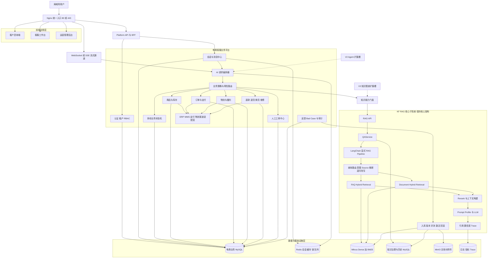
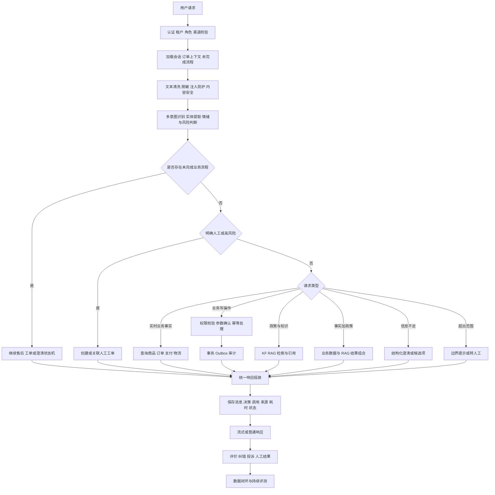
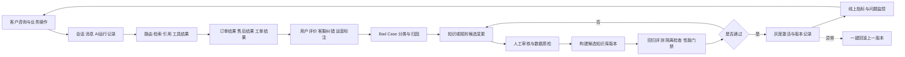

# 智能电商客服平台重构理解与初步架构

## 1 项目结论

本项目不是对原智能客服代码进行改造，也不是把现有项目与 KF RAG 通过接口简单拼接，而是从零建设一套新的智能电商客服平台。

原项目只作为业务需求底稿，用于提取商品、订单、物流、售后、人工工单、客服工作台和反馈闭环等业务能力，不继承其目录、代码组织、数据库设计和技术债。

KF RAG 作为新平台内部的知识智能核心。保留其 FastAPI、QAService、LangChain 显式 Pipeline、FAQ 与文档分层检索、Milvus Hybrid Search、Rerank、Prompt Profile、知识库版本治理、数据隔离、评测和可观测性等核心架构。第一版稳定后设置独立的 V1.5 阶段，对 KF RAG 做质量、性能和工程进阶，但不改变其核心职责与主链结构。

项目分为四个连续阶段：

| 阶段 | 建设目标 | 明确边界 |
|---|---|---|
| V1 | 从零建成完整电商客服平台，在局域网可用并实现数据闭环 | 不加入 Agent 和知识图谱 |
| V1.5 | 优化 KF RAG 的检索质量、性能、治理和可观测性 | 不改变 KF RAG 核心架构，不承担电商业务写操作 |
| V2 | 接入 Agent、工具调用、多步骤任务和人工审批 | Agent 通过工具网关访问业务能力 |
| V3 | 接入知识图谱和图向量融合检索 | 图谱是增强检索层，不替代 KF RAG |

## 2 V1 建设范围

V1 首先交付一套可独立运行的模块化平台，包含三个前端入口、统一后端、电商业务域、KF RAG 知识域、数据治理和运维能力。

### 2.1 用户入口

- 客户咨询端：登录、智能问答、订单选择、售后申请、人工接管、服务评价。
- 客服工作台：工单队列、接单、会话上下文、订单信息、回复、分类和关闭。
- 运营管理后台：知识库版本、文档入库、质量报告、反馈、业务指标和审计记录。

### 2.2 电商业务域

- 用户、账户、角色、租户和权限。
- 商品、SKU、价格、促销、库存和适配信息。
- 购物订单、订单项、支付状态和发票。
- 包裹、物流轨迹、拆单、合单和异常配送。
- 退款、退货、换货、维修、补发和价格保护。
- 投诉、风险升级、人工工单和客服会话。
- 用户反馈、纠错、Bad Case 和运营统计。

### 2.3 KF RAG 知识域

- 电商政策、商品说明、售后规则、物流规则、发票规则和客服操作规范。
- FAQ 高置信直出与文档 RAG。
- Dense 与 BM25 Sparse 混合检索。
- Rerank、上下文构建、Prompt 路由、流式生成和来源引用。
- tenant、dataset、visibility、role、scenario、kb_version 数据隔离。
- 文档入库、知识库版本、评测门禁、激活、回滚和反馈闭环。

## 3 V1 初步总体架构

新平台采用一个代码仓库、多个边界清晰的可部署单元。V1 以模块化单体业务后端为主，KF RAG 保持独立进程边界，以便模型资源隔离和后续扩容，但二者共同属于新的统一电商平台，不是两个历史项目的拼接。



## 4 完整请求逻辑链路

业务路由采用状态优先、规则优先、写操作受控、知识问答可追溯的原则。



路由优先级建议固定为：

1. 安全事件、明确人工、高风险投诉优先处理。
2. 已存在的多轮业务状态优先于重新识别意图。
3. 退款、取消、地址修改等写操作进入确定性工作流，不交给 LLM 自主执行。
4. 订单、支付、库存和物流等实时事实只查询业务数据库或受控外部系统。
5. 政策、规则、说明书和操作规范进入 KF RAG。
6. 同时涉及业务事实和政策的问题执行混合编排。
7. 信息不足时澄清，超出范围时拒答或转人工。

## 5 主流业务情况覆盖

“全部业务情况”不应依赖一份永久不变的意图枚举，而应采用业务域、场景注册表、工作流注册表和规则配置持续扩展。V1 至少覆盖以下主流情况。

| 业务阶段 | 必须覆盖的业务情况 |
|---|---|
| 售前 | 商品介绍、参数、兼容性、对比、库存、价格、优惠、赠品、预售、到货时间、配送范围、发票规则 |
| 下单 | 无法下单、限购、地址校验、优惠券不可用、价格变化、重复下单、订单合并和拆分 |
| 支付 | 支付失败、重复扣款、支付中、支付超时、分期、退款原路返回、支付风险审核 |
| 订单 | 待付款、已付款、备货、已发货、完成、取消、关闭、地址修改、备注修改、订单归属校验 |
| 物流 | 未揽收、运输中、延迟、停滞、改派、拒收、丢件、破损、虚假签收、多个包裹、跨境物流 |
| 售后 | 仅退款、退货退款、换货、维修、补发、漏发、错发、质量问题、少件、价保、部分退款 |
| 特殊商品 | 虚拟商品、定制商品、生鲜、易耗品、已激活商品、组合商品和赠品的特殊规则 |
| 发票 | 开票条件、抬头、税号、电子发票、红冲、重开、订单与开票金额不一致 |
| 账户会员 | 登录、冻结、实名、地址、隐私、会员等级、积分、权益、优惠券和账号异常 |
| 人工服务 | 主动转人工、高风险自动升级、排队、接单、会话、转派、协同、关闭、回访和满意度 |
| 投诉风控 | 服务投诉、商品投诉、欺诈、恶意索赔、敏感内容、隐私泄露、越权访问和审计追踪 |
| 系统异常 | 数据库失败、RAG 无命中、模型超时、重复请求、并发操作、消息乱序、断线重连和服务降级 |

每个业务场景统一定义：触发条件、必需槽位、权限要求、业务状态机、可执行动作、幂等键、超时策略、错误码、人工升级条件和审计字段。

## 6 核心数据模型

平台数据至少分为五组，确保业务、会话、知识和反馈能够闭环。

| 数据组 | 核心实体 |
|---|---|
| 身份权限 | tenants、users、roles、permissions、customers、agents |
| 电商业务 | products、skus、inventory、prices、promotions、orders、order_items、payments、invoices、shipments、tracking_events |
| 售后工单 | after_sales_cases、refunds、returns、exchanges、tickets、ticket_messages、ticket_assignments |
| 会话智能 | conversations、messages、workflow_instances、ai_runs、route_decisions、tool_calls、retrieval_citations |
| 治理闭环 | feedback、corrections、bad_cases、audit_logs、outbox_events、evaluation_runs、kb_release_links |

电商业务库与 KF RAG 控制面数据应使用独立数据库或独立 schema，由各自模块负责读写。两者通过应用契约交换数据，不允许业务模块直接修改 Milvus collection 或 KF RAG 内部版本表。

## 7 数据闭环



完整闭环要求任何一次回答都能够追溯到：用户、会话、原始问题、清洗文本、业务状态、路由原因、模型或规则版本、知识库版本、引用来源、业务操作结果、人工结果和最终反馈。

## 8 局域网部署方案

V1 使用 Docker Compose 完成单机局域网部署，并为后续服务器化保留迁移能力。

```text
局域网浏览器
    -> http://服务器局域网IP
    -> Nginx
       -> 前端静态资源
       -> Platform API
       -> WebSocket/SSE
    -> 内部 Docker 网络
       -> MySQL
       -> Redis
       -> KF RAG
       -> Milvus + etcd + MinIO
       -> Worker
```

部署要求：

- 服务器使用固定局域网 IP，建议配置内部域名。
- 对局域网只开放 80/443，数据库、Redis、Milvus 和 MinIO 不直接暴露。
- Nginx 统一代理 API、静态页面和流式连接。
- 密钥、数据库密码和模型配置通过环境变量或 Secret 管理。
- MySQL、Milvus、MinIO 使用持久卷，并提供定时备份与恢复脚本。
- 支持断线重连、会话恢复、重复请求幂等和服务重启后工作流恢复。
- 如果不允许访问公网，LLM 使用本地模型；如果允许受控外网，只开放指定模型供应商出口。

## 9 V1.5 KF RAG 优化范围

V1 稳定后再优化 KF RAG，允许的进阶方向包括：

- 电商 Query Rewrite、多查询扩展和追问消歧。
- FAQ 阈值、Dense/Sparse 权重、TopK 和 Rerank 参数校准。
- 商品说明、规则文档、表格、PDF 和图片 OCR 的解析质量提升。
- 电商专用 Prompt Profile、拒答策略和引用完整性检查。
- Embedding、检索结果和只读标准问答缓存。
- 知识库灰度发布、版本对比、回滚和租户隔离增强。
- Recall、MRR、答案忠实度、引用正确率、延迟和成本评测。
- LangSmith 或本地 Trace、阶段耗时、模型用量和异常监控。
- 并发、批量入库、索引构建和模型预热优化。

V1.5 不加入 Agent，不让 RAG 执行退款、修改订单、关闭工单等业务写操作，也不改变 KF RAG 的核心分层和主链职责。

## 10 V1 验收标准

- 三类前端入口均可通过局域网访问。
- 用户身份、租户、订单归属和客服权限不能越权。
- 商品、订单、物流、售后、人工工单和知识问答主流程全部可运行。
- 售后流程可以跨多轮会话恢复，重复提交不会生成重复业务单。
- RAG 回答必须包含知识库版本、来源和引用；无依据时明确拒答或转人工。
- 人工接管后能够查看完整上下文，并将处理结果回写给客户。
- 用户评价、客服纠错和失败样本能够进入 Bad Case 与知识评测流程。
- 服务重启后业务数据、会话状态、知识版本和工单状态不丢失。
- 数据库、缓存、向量库和对象存储具备备份恢复验证。
- 核心路径具备单元测试、集成测试、端到端测试、权限测试和故障测试。

## 11 下一步

下一阶段先冻结 V1 的产品范围、业务状态机、API 契约和数据库边界，再创建全新的项目骨架。原项目与 KF RAG 均保持只读参考，待骨架和契约评审通过后再迁移可复用的业务规则、场景数据和 KF RAG 核心模块。
