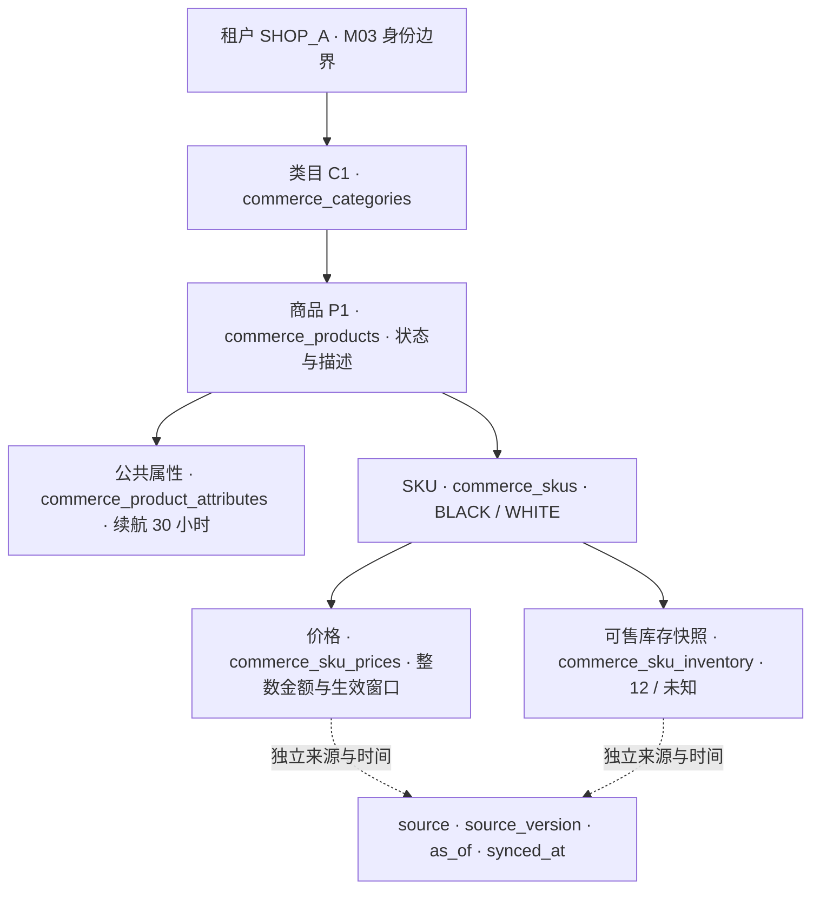

# M04.1 商品模型第一课

## 本步要解决的问题

用户问“这款耳机黑色多少钱，还有货吗”，系统必须先有可查询的商品事实，而不是让大模型猜测。本步建立这些事实的结构，不做聊天路由、HTTP 查询接口或第三方同步。

以 SHOP_A 的 P1 蓝牙耳机为例：类目是耳机；商品描述它的用途；属性记录续航 30 小时；BLACK 和 WHITE 是两个 SKU。BLACK 价格快照是 29900 CNY 最小单位，即 299.00 元，库存 12；WHITE 库存未知，不能回答“没货”。这是合成教学例子，不是店铺在售数据。

## 从一个入口看六张表

下图是数据归属和外键关系，不是已经上线的 HTTP 请求链路。每条关联都同时携带 tenant_id。



| 数据 | 主要字段 | 必须理解的边界 |
|---|---|---|
| 类目 | tenant_id、id、parent_id、name | 可多级；不允许自引用；完整环检测留待同步阶段 |
| 商品 | tenant_id、id、category_id、name、description、status | 同一商品可有多个规格，不直接保存某个 SKU 的库存 |
| 属性 | tenant_id、product_id、name、value、unit | 公共参数；不是自由执行的指令，后续输出仍需转义 |
| SKU | tenant_id、id、product_id、code、specifications、status | 店内 code 唯一，店间允许相同；规格键不可重复 |
| 价格 | tenant_id、sku_id、minor_units、currency、valid_from、valid_until | 一条当前快照；不是促销计算或最终支付报价 |
| 库存 | tenant_id、sku_id、available_quantity | NULL 未知、0 缺货、正数可售量快照；不是下单预留 |

六张表都有来源、版本、来源时间和同步时间。例：12:00 的库存于 12:10 重试同步，来源时间仍是 12:00；否则会把旧数据包装成实时数据。领域对象要求 UTC；SQL 保存六位微秒 UTC，避免时间窗口精度丢失。

## 代码分层为什么这样放

`packages/domain/ics_domain/catalog.py` 是纯 Python 规则，只创建不可变对象，不联网、不写库。`packages/persistence/ics_persistence/commerce_schema.py` 描述 SQL 类型、主外键和约束。`m04_0004_catalog.py` 是冻结的迁移版本，未来改运行时代码不会悄悄改变已经发布的旧迁移。

Commerce 仍是这些数据的唯一业务所有者。共享 SQL 包用于当前单库部署，不代表 Gateway 或 RAG 可以直接读写商品。M04.2 的调用链将是“已认证请求 → Commerce 租户授权 → 带租户过滤的查询 → 有来源的响应”；这条接口链本步还没有实现。

## 在 PyCharm 里亲自运行一次

项目根目录为 `F:\heima\ai\python\project\i`，解释器继续使用已有 `intelligent-commerce-support-v1`，不用安装新环境。

```powershell
. .\scripts\enter_environment.ps1
python scripts/demo_catalog_models.py
```

预期看到 BLACK 的价格 299.00 CNY、库存 12，以及 WHITE 的“未知，不能回答缺货”。这个命令只构造内存对象，不发送请求也不写商品。可以在 `SkuInventory.__post_init__` 加断点，再把示例库存改为 -1 观察校验如何拒绝；不要在运行时绕过异常强行写库。

然后阅读 `Observation`，理解两个时间；阅读 `SkuPrice`，理解为什么拒绝 float 和 bool；最后对照 SQL 的复合外键，理解“数据关联不能串店”和“用户读权限”是两种不同保护。

## 本次实际行为

- 新增纯模型、六表映射、迁移、模型示例、本机迁移检查与测试；修改迁移头和元数据入口，将 domain 纳入现有 Ruff/Bandit 门禁。
- 没有安装或升级依赖、没有下载模型、没有调用百炼、没有修改 KF，没有清理维护测试组。
- 真实 MySQL 使用专属临时容器；测试写合成组织、店铺、商品及 SKU，结束后只删除该容器与不可恢复的合成 tmpfs 数据，不删除开发卷。
- 开发库升级只加六张空表和推进版本号，不导入演示商品、不改变角色权限、不建立默认账号。实际结果见 `_local_artifacts/m04-1/local-upgrade.json`。
- 日志和验收报告位于 `_local_artifacts/m04-1`，新增文件仍跟随 F 盘项目。Git 只提交源码、测试和文档。

## 验证入口

```powershell
python scripts/check_backend.py tests
python scripts/check_contracts.py
python scripts/check_mysql.py
python scripts/ci.py
python scripts/check_backend.py security
python scripts/check_catalog_local.py
```

MySQL 验证包含从 M03 带数据升级、空库迁移往返、metadata 对比、微秒往返、租户隔离关联、唯一编码、非法金额/库存/时间/状态拒绝和非空拒绝降级。CHECK 违反在当前 PyMySQL 下是 OperationalError 3819，测试核对确切错误号，不能笼统把任何异常视为通过。

本机迁移必须显式执行 `python scripts/check_catalog_local.py --upgrade`，不是启动网关自动改表。该工具先验证新平台 MySQL 的归属、镜像与端口；不接受任意数据库 URL。MySQL DDL 不是原子事务，遇到失败保留现场，不自动删表或强制标版本。

## 当前交付状态

本机 MySQL 28 项通过；169 项契约及基础治理通过；源码和已锁依赖安全检查通过，无新增漏洞豁免。开发库从 m03_0003 升到 m04_0004，六张商品表均为 0 行，metadata 一致；网关/数据库/匿名 401 联测通过，临时网关已停止。启动包 SHA-256 与登记基线一致。

首次约束测试因异常类别断言不正确失败，修正为精确 MySQL 错误号后复验通过；未放宽数据库约束。既有测试仍有两条框架弃用警告，本步未为消除警告而升级依赖。

M04.1 DONE：实现 `04c6140` 已推送，[CI 34753021322 SUCCESS](https://github.com/sy824869109/intelligent-commerce-support-v1/actions/runs/34753021322)。最终后端 125 项通过（比 M03 增加 35 项）；契约 169 项、真实 MySQL 28 项通过，基础运行 244 项（Windows 跳过 5 项）。前端业务与手动 Milvus 全源码审计作业按原策略跳过，不写成已执行通过。M04.2–M04.4、完整业务前端、RAG 在线业务链路和 93 条综合用例均未完成。

下一步 M04.2 将把这些模型接成真正可调用的商品搜索、详情、规格、库存和活动说明接口；来源新鲜度、可见状态和 M03 权限必须共同参与响应，不能因为模型存在就宣称接口已上线。
