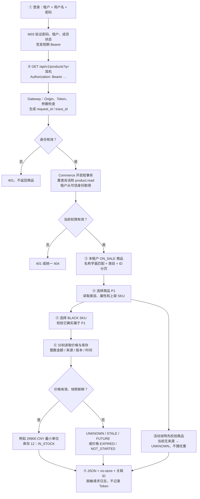

# M04.2：从登录到真实商品查询

本步将 M04.1 模型接成五个查询接口。复用已有 V1 Conda 和 MySQL，没有安装依赖，没有改原项目或 KF。开发库仍没有商品：有数据才返回事实，不自动生成商品。

## 一条链看懂职责



甲店与乙店都有 P1，甲店用户只能得到甲店耳机。黑色库存 12、白色 NULL、另一规格 0，分别是有库存快照、未知、明确缺货。示例来自隔离测试，未写入开发库。

## 五个接口

前缀 `/api/v1/products`，均为 GET，均需 Bearer。

| 路径 | 输入 | 返回 |
|---|---|---|
| 空路径 | q、category_id、after、limit | 商品页、next_cursor、has_more；默认 20，最大 100 |
| /{product_id} | 商品 ID | 商品、类目与各自来源 |
| /{product_id}/specifications | after、limit | 属性 + 上架 SKU 页 |
| /{product_id}/skus/{sku_id} | 商品与 SKU ID | 规格、价格、库存及独立状态 |
| /{product_id}/activity | 商品 ID | 当前 UNKNOWN：暂无可核实活动信息 |

额外 tenant_id、actor_id、重复参数、非法分页拒绝；详情端点不接受查询参数。草稿、下架、停售、不存在与错误父子关系统一 404，管理员也不绕过。

响应带 request_id/trace_id/data；错误带 error.code。典型错误：AUTH_REQUIRED 401、ACCESS_DENIED 404、VALIDATION_ERROR/INPUT_INVALID 422、CATALOG_DATA_INVALID/CATALOG_UNAVAILABLE 503。认证阶段底层故障沿用通用 500。完整字段见 [真实 OpenAPI](../api/m04-catalog.openapi.json)。

## 在 PyCharm 中学习

1. 解释器仍选现有 intelligent-commerce-support-v1，不新建环境。
2. 看 `apps/api-gateway/ics_gateway/catalog.py`：输入如何声明、为什么这里没有 SQL。
3. 在 `apps/commerce-service/ics_commerce/catalog.py` 的 `_scope`、`_product`、`sku` 打断点。
4. Debug 运行 `tests/backend/test_catalog_api.py::test_authorized_full_query_flow`。它经 HTTP 登录再查询，内部执行真实 SQL；本地默认隔离 SQLite，不写开发库。
5. 看 `snapshot()` 转换到上一课模型，`public()` 去掉内部租户字段并标记来源新鲜度。
6. 看 `views.py` 与 OpenAPI：前端应读状态，不能遇到 null 就补 0。

根目录 PowerShell：

```powershell
. .\scripts\enter_environment.ps1
python scripts/check_backend.py tests
python scripts/check_mysql.py
python scripts/check_catalog_local.py
python scripts/run_gateway.py --with-database
```

最后一条启动真实网关（默认 127.0.0.1:28000），Ctrl+C 停止。已有 M03 管理员可登录；首次初始化见 [M03 说明](m03-identity-acceptance.md)，密码/Token 不进聊天或 Git。本步不创建账号。当前商品为空，授权列表应为空；有数据的流程用隔离测试学习，商品同步在 M04.3 实现。

## 事实使用边界

- 窗口暂定 300 秒，旧来源 STALE，未来来源 FUTURE；重新同步不刷新旧来源。
- AVAILABLE 只是有效价格快照，不是支付报价。29900 CNY = 299 元；不能假设所有币种都除以 100。
- price/inventory 为 null 表示无快照；available_quantity 为 null 表示上游未知；0 才是已知缺货。
- 旧快照只解释上次观察，不承诺当前价格和库存。每个事实时效独立，无跨表原子报价、无库存预留/扣减。
- UNKNOWN 活动不等于没有活动。活动知识和叠加规则在 M09/M10 接入，不用 LLM 补齐。
- 名称/说明是纯文本，未来 Vue 须转义。搜索是字面包含，不是 RAG；分页不是跨请求一致性快照。

## 行为与文件

| 行为 | 实际影响 |
|---|---|
| 新代码 | Commerce 查询/响应、Gateway 路由、权限迁移、OpenAPI 导出、测试 |
| 修改 | 装配入口、商品资源授权、角色种子、HEAD、检查脚本与 CI 测试入口 |
| 开发库 | m04_0004 → m04_0005；product.read + 三条授权；六张商品表仍为 0 行 |
| 测试 | 专属 MySQL 容器写合成账号/商品，结束仅删除该容器和不可恢复的合成 tmpfs 数据 |
| 进程 | 联测使用自有临时网关，测试完停止，不停其他服务 |
| 报告 | `_local_artifacts/m04-2`；网关沿用其原报告目录；不覆盖 M04.1 迁移证据 |
| 未做 | 未安装依赖/下载模型/调用百炼，未改 KF/原项目，未迁移 Docker 数据，未清理维护测试组 |

启动 TAR SHA-256 仍为 `7690AAD97C5593C3AA2791C48FD05096D723859AF75653A4A78BDEDABEB0C7AE`，包内参考资产未变。

## 验收记录

初轮 MySQL 因模拟客户端地址共用触发登录限流，修正测试隔离后通过，未降低实际限流。旧降级测试要求稳定的 non-empty 信息，新迁移对齐，未放松降级保护。

本地后端 156 项、契约 169 项、真实 MySQL 59 项通过；基础测试运行 244 项（Windows 跳过 5 项）。Ruff、Bandit 与锁定依赖审计通过，旧测试工具弃用提示保留，不因此升级环境。开发库 m04_0005 READY，五个商品入口真实本机 HTTP 匿名 401 联测通过，临时网关已停止。

实现提交 `f778dff3586e3ba4548ba5ea4ea37c79e18b0085` 已推送到 `origin/codex/v1-greenfield`，[GitHub CI 34796282887 SUCCESS](https://github.com/sy824869109/intelligent-commerce-support-v1/actions/runs/34796282887)。Windows/Linux 后端与契约、基础、安全与四镜像门禁通过。前端 M14 和手动 Milvus 全源码审计按既有策略跳过，不写成已运行。Windows CI 的现有 setup-miniconda 初始化/Node 弃用注释不影响最终成功；没有改动本机 Conda 或降低门禁。

下一任务 M04.3 商品同步与幂等，不自动进入下一卡。
